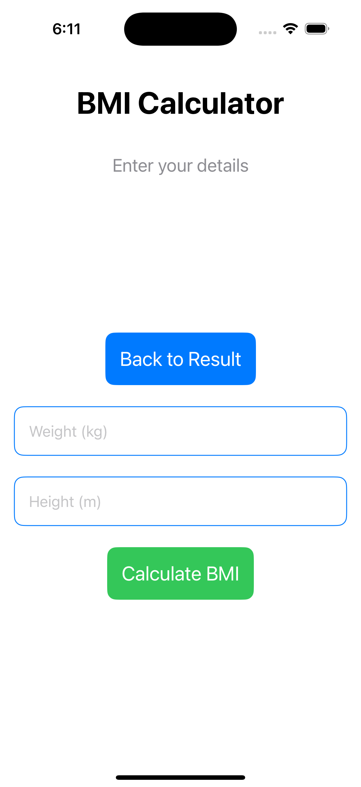
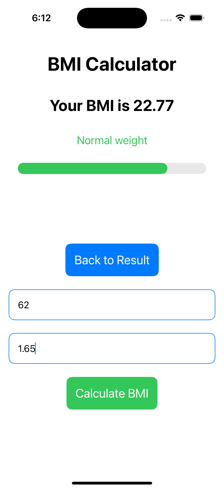

# BMI Calculator Application  

## 📄 About the Project  
This is a simple yet functional BMI (Body Mass Index) Calculator application developed using Swift and SwiftUI. The app allows users to calculate their BMI by entering their weight and height.  

### Features  
- Input fields for weight and height.  
- BMI calculation with a simple formula.  
- A clean and user-friendly interface.  
- Displays the calculated BMI and its category (e.g., Underweight, Normal, Overweight).  

## 📷 Screenshots  


(Simulator Screenshot - iPhone 16 Pro - 2024-11-21 at 18.12.18.png)
(Simulator Screenshot - iPhone 16 Pro - 2024-11-21 at 18.13.01.png)

## 👨‍🎓 Developer Information  
**Name:** Swapnil Kundu Argha
**Roll Number:** 2007062  
**Year:** 3rd year 2nd semester 

## 🚀 Getting Started  
1. Clone the repository:  
   ```bash  
   git clone https://github.com/YourUsername/BMI-Calculator.git  
